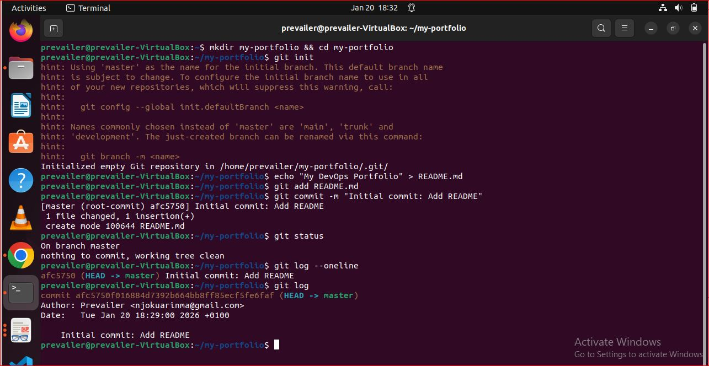
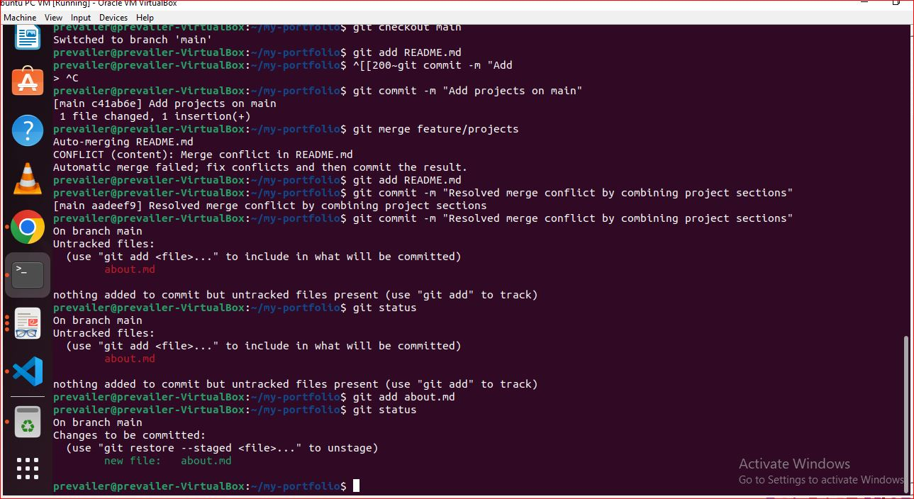
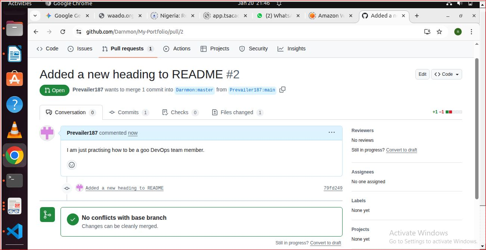

# DevOps Lab Report: Git Basics

## Checkpoints

## Brief Reflection
**What was challenging?**
The most challenging part was understanding the difference between the 'master' and 'main' branch names and resolving the merge conflict.

**How does Git help in DevOps teams?**
Git acts as a single source of truth. It allows team members to work on features simultaneously using branches, ensures code quality through reviews, and provides a 'time machine' to undo errors quickly.

## Issues Faced & Resolutions
1. **Issue:** Remote URL typo (`gi#t`).
   - **Resolution:** Used `git remote set-url origin` to fix the address.
2. **Issue:** Refspec 'main' error.
   - **Resolution:** Renamed local branch to 'main' using `git branch -M main`.